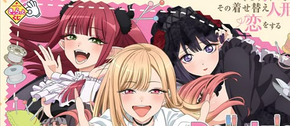

<div align="center">



<br>


<br>


</div>

---

# 🌸 About Me


```cpp
class Developer {
public:
    std::string name = "Law";

    std::string os = "Windows 11 (Debloated) // Arch Linux";
    std::string editor = "VS Code";

    std::vector<std::string> langs = {
        "C",
        "C++",
        "TypeScript",
        "JavaScript"
    };

    bool likesAnime = true;
    bool touchesGrass = false;
};
```

---

# ⚡ Tech Stack

<p align="center">


</p>

---

# 🚀 Featured Projects

<table>
<tr>
<td width="50%">

### RTW

Minecraft Fabric mod

Real-time weather synchronization

</td>

<td width="50%">

### Utils

Linux CLI toolkit

Written in modern C++

</td>
</tr>
</table>

---

# 🌸 Currently

```yaml
working_on:
  - RTW
  - Linux Utilities
  - Web Development

learning:
  - Low-level systems
  - Rendering
  - Networking

watching:
  - My Dress-Up Darling
```

---

# 💖 Favorite Anime

<table>
<tr>
<td>My Dress-Up Darling</td>
<td>Horimiya</td>
<td>Oshi no Ko</td>
<td>Serial Experiments Lain</td>
<td>LuckyStar</td>
</tr>

<tr>
<td>The Angel Next Door</td>
<td>Bocchi the Rock</td>
<td>Alya Sometimes Hides Her Feelings</td>
<td>Uma Musume</td>
<td>Ruri no Houseki</td>
</tr>
</table>

---

<div align="center">

### Thanks for visiting 💖


</div>
